# **Git and GitHub**  

I used to save multiple copies of files like:  
- `NMDS_trial_v1.R`  
- `NMDS_trial_v2.R`  
- `NMDS_working_Final.R`  

This quickly becomes messy—it’s hard to track changes, and files take up unnecessary space.   Instead of creating multiple files, saving  multiple versions inside a single file (like versions in google docs) makes folders clutter free and accessing different versions easier. Version Control Systems enable storing multiple versions inside a single file and among the many Version Control Systems , Git is the most popular. 

Git is a free, open-source **version control system** that:  
- **Tracks every change** in your files (code, documents, scripts, etc.).  
- **Lets you revert to any previous version** if something goes wrong.  
- **Prevents the need for duplicate files** (no more `_final_final` naming chaos!).  

Instead of manually saving copies, Git keeps a complete history of modifications, so you can always go back in time.  

### **Installing Git**  

Git is **preinstalled** on **macOS** and **Linux**, so you can start using it right away.  

#### **Windows Users: Downloading Git**  
If you're on **Windows**, follow these steps:  
1. **Download Git** from the official website: [https://git-scm.com/](https://git-scm.com/)  
2. **Choose the correct version** for your system (64-bit or 32-bit).  
   - *Avoid the "Portable" edition*—it’s meant for advanced use cases.  
3. **Run the installer** and follow the default settings (no need to customize).   
After installing, open:  
- **Command Prompt (Windows)**  
- **Terminal (macOS/Linux)**  

Then, type:  
```bash
git --version
```  

If you see a version number (e.g., `git version 2.40.1`), Git is ready to use!

### **Setting Up Git in a Project Folder**  

After installing Git, follow these steps to start tracking changes in your project:  

- Navigate to the folder containing your project files.   
- **Windows:**  
  - Right-click in the folder → Select **"Open Git Bash here"** (this opens Git’s command-line tool).  
- **Mac/Linux (Terminal) or Windows (CMD/PowerShell):**  
  - Open your terminal and navigate to the folder using:  
  
```sh
cd /path/to/your/project
```  
- Run the following command to start tracking changes:  
```sh
git init
```  
- This creates a hidden `.git` folder that stores all version history.  

**Exclude Unwanted Files (Optional)** 
Some files (like large datasets, logs, or sensitive info) shouldn’t be tracked. To ignore them:  

 **Create a `.gitignore` file:**  
   - Open a text editor (VS Code, Notepad, etc.) and create a blank text file. 
   - List files/folders to exclude (one per line):  

     ```bash
     # Example .gitignore file
     credentials.txt
     raw_data/
     *.log
     .env
     ```  

   - Save the file as `.gitignore` in your project’s root folder.  

 **Git will now skip these files** when tracking changes.  

**Verify Setup**  

- Check tracked files with:  
  ```sh
  git status
  ```  
- Untracked files (not in `.gitignore`) will appear in red.  

Now your project is version-controlled!  

### **Git Workflow: Basic Steps**  

### **1. Staging Files**  
Git doesn’t track files automatically—you must **stage** them first.  
You create a new file, `Scripts.R`, containing R code. To start tracking it run:  

```sh
git add Scripts.R
```  

**Staging Multiple Files at Once**  
- To stage **all new/modified files** in the folder, run:  

  ```sh
  git add .
  ```  
- Add **only specific files**:  
  ```sh
  git add file1.R file2.py
  ```  

- Add **files with space in filename**: 
  ```sh
  git add "file name.R"
  ```  

### **2. Committing Changes**  
A **commit** saves a snapshot of your project at a specific time.  

**How to Commit**  
After staging files, save the version with: 

```sh
git commit -m "Initial script with basic data cleaning"
```  
- **`-m`** lets you add a short **commit message** (required).  
- A good message explains **what changed** (e.g., *"Added regression model"*).  


**Example Workflow**  
1. While modifying `Scripts.R` you introduced a bug.  
2. To revert to the last working version:  
   - Check your commit history:  

```sh
git log
```  

3. Copy the commit ID (e.g., `d3b4a1c....`) and restore it:  

```sh
git checkout d3b4a1c Scripts.R
```  

  


### **Key Takeaways**  
 **Stage changes** → `git add <file>`  
 **Save snapshots** → `git commit -m "message"`  
 **Recover old versions** → `git log` + `git checkout <commit>`  

This workflow keeps your project organized and safe from accidental errors. 

### **3. Pushing to GitHub: Collaborative Version Control**

#### **Why Use GitHub?**
While Git tracks changes locally, **GitHub** serves as a centralized cloud platform for:
- **Team collaboration** – Multiple contributors can work on the same project simultaneously.  
- **Version synchronization** – No more emailing files; everyone pulls/pushes updates to a shared repository.  
- **Backup & recovery** – Safeguard your project against local hardware failures.  

#### **How It Works**
1. **Local (Git)**  
   - You commit changes on your computer.  
2. **Remote (GitHub)**  
   - You `push` those commits to GitHub, making them available to your team.  
   - Teammates `pull` the latest version to their local machines.  

#### **Alternatives**
- GitLab, Bitbucket – Similar platforms with different features.  


### **4. Setting Up GitHub for Git**

#### **Step 1: Create a GitHub Account**
1. Go to [GitHub.com](https://github.com) and sign up.  
2. Verify your email.  

#### **Step 2: Generate a Personal Access Token (PAT)**
GitHub requires a PAT (instead of passwords) for secure Git connections.  

**To create one:**  
1. Navigate to:  
   ```
   Profile > Settings > Developer Settings > Personal Access Tokens > Generate New Token
   ```  
2. Set:  
   - **Expiration**: Choose a duration (e.g., 30 days).  
   - **Permissions**: Check `repo` (full control of private repositories).  
3. **Copy the token** and store it securely (*it won’t be shown again!*).  

#### **Step 3: Link Git to GitHub**
1. **Configure Git with your GitHub credentials**:  
   ```sh
   git config --global user.name "YourGitHubUsername"
   git config --global user.email "your.email@example.com"
   ```  
2. **Authenticate with your PAT** when pushing/pulling.  


### **5. Connecting Your Local Git Repository to GitHub**  

Now that you have a local Git repository and a GitHub account, let’s upload your project to GitHub for collaboration and backup.  


#### **1. Create a New Repository on GitHub**  
- Go to [GitHub.com](https://github.com) → Click **"New repository"**  
- Enter a **Repository name** (e.g., `my-project`)  
- **Do not** initialize with `README.md`, `.gitignore`, or license (since your local repo already exists).  
- Click **"Create repository"**  


#### **2. Link Your Local Repository to GitHub**  
- Copy the URL of your new GitHub repo (e.g., `https://github.com/your-username/my-project.git`)  
- In your **local Git terminal** (Git Bash, Terminal, or CMD), run:  
  ```sh
  git remote add origin https://github.com/your-username/my-project.git
  ```  
  **Makes sure you are running it from your local project directory** 


#### **3. Push Your Files to GitHub**  
1. **Stage all changes**:  
   ```sh
   git add .
   ```  
   (Or stage specific files with `git add file1.txt file2.R`)  

2. **Commit with a descriptive message**:  
   ```sh
   git commit -m "Initial upload: data cleaning scripts"
   ```  

3. **Push to GitHub**:  
   ```sh
   git push -u origin main
   ```  
   - `-u` sets `origin main` as the default remote branch (so next time, just `git push` will work).  


### **Troubleshooting**  
- **Error: Remote 'origin' already exists?**  
  Run `git remote remove origin` first, then re-add.  
- **Permission denied?**  
  Make sure you’ve entered the correct **PAT (Personal Access Token)** when prompted.  


### **What Happens Now?**  
Your local files are now on GitHub.  
Teammates can `git clone` your repo to contribute.  
Future changes can be pushed with just `git push`.  

Your project is now **backed up, shareable, and ready for collaboration!**   

### **5. Forking a Repository on GitHub**

#### **What is Forking?**
Forking creates **your personal copy** of someone else's repository on GitHub. This allows you to:
- Experiment with changes without affecting the original project  
- Contribute to open-source projects  
- Use others' code as a starting point for your own projects  

#### **How to Fork a Repository**
1. **On GitHub**, navigate to the repository you want to fork  
2. Click the **"Fork"** button (top-right corner)  
3. Select your account as the destination (if you belong to organizations)  

*Now you have an independent copy under your GitHub account!*

#### **Working with Your Fork**
To get the code on your local machine:
```sh
git clone https://github.com/your-username/forked-repo.git
cd forked-repo
```
This downloads the repository to your computer.

#### **Keeping Your Fork Updated**
To sync with the original repository:
1. Add the original as a remote:
```sh
git remote add upstream https://github.com/original-owner/original-repo.git
```
2. Fetch updates:
```sh
git fetch upstream
```
3. Merge changes:
```sh
git merge upstream/main
```

#### **Contributing Back**
If you've made improvements:
1. Push to your fork:
```sh
git push origin main
```
2. Create a **Pull Request** on GitHub to suggest your changes to the original project

#### **Key Points**
- Forking is non-destructive (the original repo remains unchanged)
- Your fork exists independently on your GitHub account
- You control what changes get merged back to the original project

### **6. Cloning a GitHub Repository to Your Local Machine**  

 

Cloning downloads a **full copy** of a GitHub repository (including all files, branches, and commit history) to your local computer. This lets you:  
- Work on projects offline  
- Contribute to team/shared repositories  
- Experiment with code without affecting the original  


### **How to Clone a Repository**  

#### **1. Get the Repository URL**  
On GitHub:  
1. Navigate to the repository you want to clone  
2. Click the green **"Code"** button  
3. Copy the **HTTPS URL** (e.g., `https://github.com/user/repo.git`)  

#### **2. Clone the Repository**  
In your terminal (Git Bash, Terminal, or CMD), run:  
```sh
git clone https://github.com/user/repo.git
```  
- This creates a local folder with the repository’s contents.  
- To specify a custom folder name:  
  ```sh
  git clone https://github.com/user/repo.git my-folder
  ```  

#### **3. Navigate into the Repository**  
```sh
cd my-folder  
```  

### **Working with a Cloned Repository**  
Once cloned, you can:  
1. **Make changes** → Edit files as needed  
2. **Stage changes** → `git add .`  
3. **Commit changes** → `git commit -m "Your message"`  
4. **Push changes** (if you have write access):  
   ```sh
   git push origin main
   ```  


### **Collaborating on Shared Repositories**  
If you **don’t have direct write access** (common in open-source projects):  
1. **Fork the repository first** (creates your personal copy)  
2. **Clone your fork** instead of the original  
3. **Push changes to your fork**  
4. **Submit a Pull Request (PR)** to propose your changes to the original repository  


### **Key Notes**  
Cloning is different from forking:  
- **Forking** = Creates your GitHub copy of a repo  
- **Cloning** = Downloads any repo (yours or others') to your computer  

Always `git pull` before working to get the latest changes from teammates!  

### **7. Using `git pull` to Sync Remote Changes**

#### **Why Pulling is Necessary**
When collaborating on shared repositories:
- Other contributors may push changes to the remote (GitHub) repo
- Your local copy becomes outdated
- Git prevents `git push` until you sync these changes to avoid conflicts

#### **How Pulling Works**
`git pull` performs two actions:
1. **Fetches** all new changes from the remote repository
2. **Merges** them into your local branch

#### **When to Use `git pull`**
- Before starting work on shared files
- When you see this error:
  ```
  ! [rejected] main -> main (non-fast-forward)
  error: failed to push some refs...
  hint: Updates were rejected because the remote contains work you don't have locally
  ```

#### **Basic Pull Command**
```sh
git pull origin main
```
- `origin` = Remote repository name (default)
- `main` = Branch name

#### **Resolving Merge Conflicts**
If remote changes conflict with your local changes:
1. Git will mark conflicted files
2. Manually edit files to resolve conflicts
3. Mark as resolved:
   ```sh
   git add <file>
   git commit -m "Resolved merge conflicts"
   ```

#### **Best Practices**
1. Always pull before pushing:
   ```sh
   git pull && git push
   ```
2. Consider using `git pull --rebase` for cleaner history (advanced)
3. Pull frequently to minimize large merge conflicts

#### **Visualizing the Process**
```
Your Local: A -- B -- C
Remote:     A -- B -- D -- E

After git pull:
Your Local: A -- B -- C -- D -- E
```

# 8. Creating and switching branches (git branch)


Git branches allow you to experiment with changes in a project without affecting the original (main) version. Each branch acts as an independent workspace where you can modify files, test new approaches, and refine your work before deciding whether to incorporate those changes into the primary codebase.  

### Example Scenario: Comparing Two Data Analysis Methods  

Suppose you are working on a dataset and want to compare two different analysis techniques:  

1. **Start with the Main Branch**  
   - The `main` branch (or `master` in older repos) contains the original, stable version of your project.  
   - You clean and preprocess the dataset in `main`, ensuring a reliable baseline.  

2. **Create a New Branch for the First Analysis Method**  
   - Use `git checkout -b analysis_method1` to create and switch to a new branch.  
   - Here, you implement your first analysis approach, making changes without affecting `main`.  

3. **Create a Second Branch for the Alternative Method**  
   - Switch back to `main` (`git checkout main`) to ensure a clean starting point.  
   - Create another branch: `git checkout -b analysis_method2`.  
   - Develop and test the second analysis technique independently.  

4. **Compare Results and Merge the Best Approach**  
   - After evaluating both methods, decide which one performs better.  
   - Merge the preferred branch into `main` (e.g., `git merge analysis_method1`).  
   - The other branch (`analysis_method2`) can be kept for reference or discarded.  

#### Key Commands Used:  
- `git branch` → Lists all branches.  
- `git checkout -b <branch_name>` → Creates and switches to a new branch.  
- `git push origin <branch_name>` → Uploads the branch to a remote repository (e.g., GitHub).  
- `git merge <branch_name>` → Combines the specified branch into your current branch (e.g., `main`).  

#### Why This Workflow Matters:  
- **Isolation of Changes**: Each analysis method is developed separately, preventing conflicts.  
- **Experimentation Without Risk**: If one method fails, `main` remains unaffected.  
- **Controlled Integration**: Only validated changes are merged, maintaining project stability.  

By using branches, you ensure a structured, reversible, and collaborative workflow—especially useful in data science, software development, and research.


# **9. Merging Changes with `git merge`**

#### **When to Use Merge**
Merging combines changes from different branches into one. Common scenarios:
- Combining a feature branch back into `main`
- Incorporating teammates' work into your branch
- Finalizing approved pull requests

#### **Basic Merge Workflow**

1. **Checkout the target branch** (where you want to merge into)
   ```sh
   git checkout main
   ```

2. **Pull latest changes** (always sync first!)
   ```sh
   git pull origin main
   ```

3. **Merge your feature branch**
   ```sh
   git merge feature-branch
   ```

#### **Merge Conflict Resolution**
When Git can't automatically combine changes:
1. Git will mark conflicted files
2. Open files and look for conflict markers:
   ```
   <<<<<<< HEAD
   Your local changes
   =======
   Incoming changes
   >>>>>>> feature-branch
   ```
3. Manually edit to resolve, then:
   ```sh
   git add resolved-file.txt
   git commit
   ```

#### **Best Practices**
Always merge into the *target* branch (checkout main first)  
Test merged code before pushing  
Delete merged branches to keep repo clean:
   ```sh
   git branch -d feature-branch
   ```

#### **Visual Example**
```
          ABC feature-branch
         /         \
main DE--F (merge commit)
```


# **10. Temporarily Setting Changes Aside with `git stash`**

Assume you're working on **Analysis Step 3**, but a collaborator wants you to fix to something in **Analysis Step 2** and need updated file:
- If you switch branches now, your unfinished **Step 3** changes would either:
  - Get accidentally committed with the **Step 2** fix (causing confusion), or
  - Force you to lose your **Step 3** progress

#### **`git stash`**
Stashing lets you **temporarily shelve** uncommitted changes so you can:
1. Cleanly switch tasks
2. Push urgent fixes
3. Later restore your exact working state


### **How to Use Git Stash**

#### **1. Stash Your Current Changes**
```sh
git stash push -m "WIP: Analysis Step 3"
```
- `-m` adds a descriptive message (recommended)
- This saves all modified tracked files (both staged & unstaged)

#### **2. Verify Changes Are Shelved**
```sh
git stash list  # Shows all stashes
git status      # Shows clean working directory
```

#### **3. Make Your Urgent Fix**
```sh
git checkout main           
# Switch to correct branch and make changes for Analysis Step 2
git add .
git commit -m "Fixed analysis step 2"
git push origin main
```

#### **4. Restore Your Work**
```sh
git stash pop  # Restores most recent stash AND removes it from stash list
```
Alternative:
```sh
git stash apply  # Keeps stash in list for reuse
```


### **Key Benefits**
**Clean context switching** - No half-finished code in commits  
**Emergency fix readiness** - Handle urgent requests without losing progress  
**Multi-task management** - Juggle multiple features/bugs simultaneously  


# Running git from R Studio

R Studio has built-in Git GUI window for streamlined workflows. If you already set up git in your project directory , choose `Existing directory` and proceed. If you want to clone a GitHub repo, select  _Version Control_.

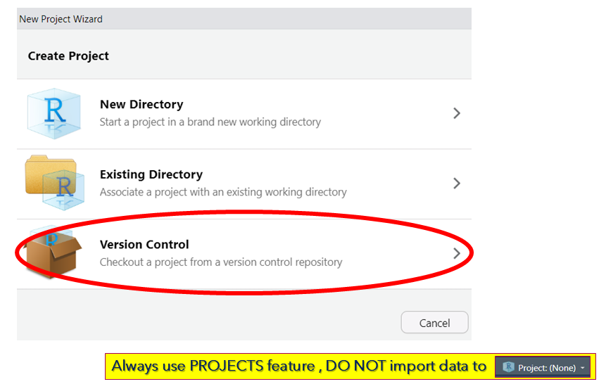

**Select Git** 

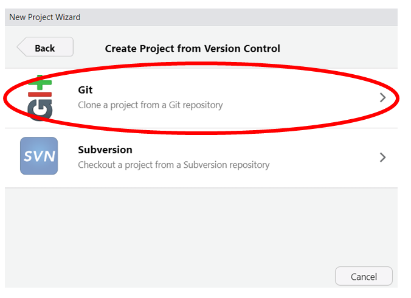

**Go to GitHub and copy the the url for GitHub repo.**
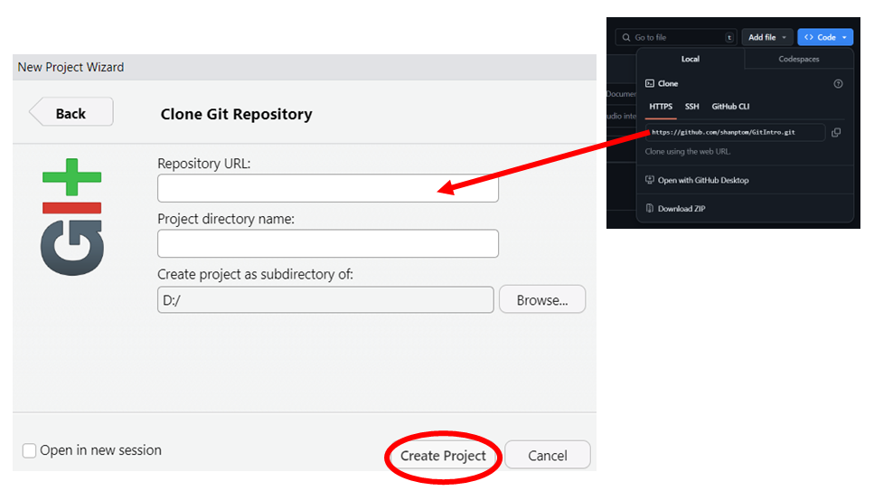

**The new project will have Git Window enabled. If you open a git enabled project directory, it will automatically enable the Git window**.

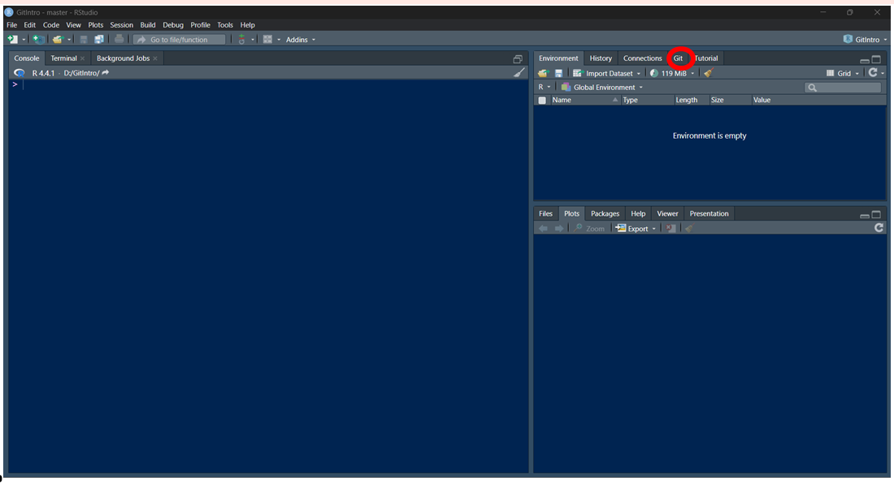

**Open the file**

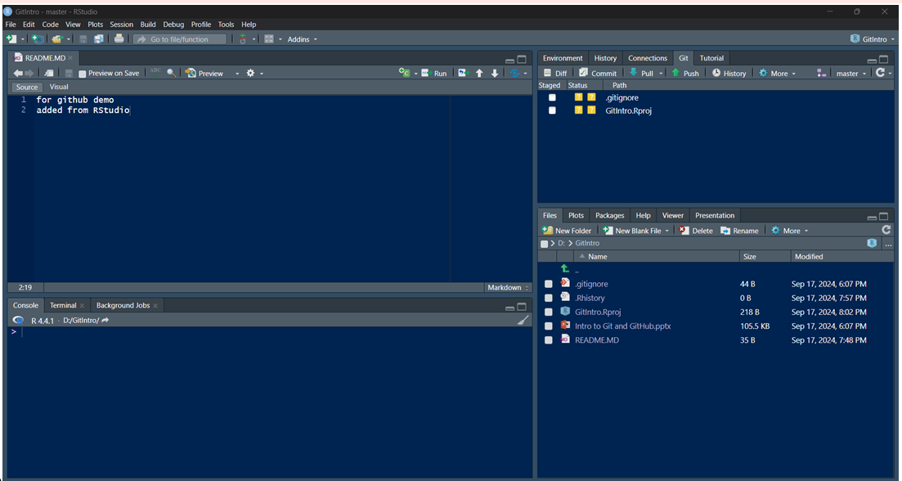


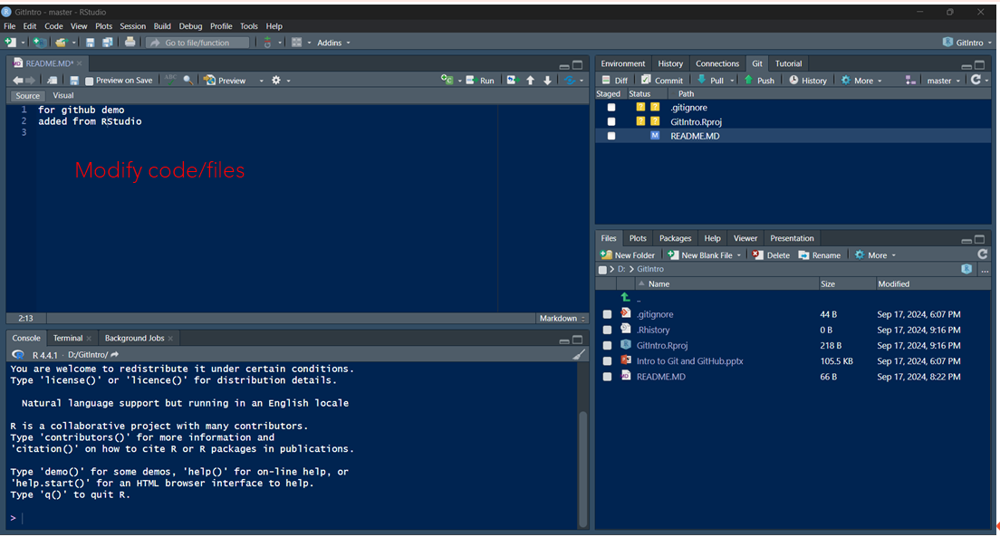

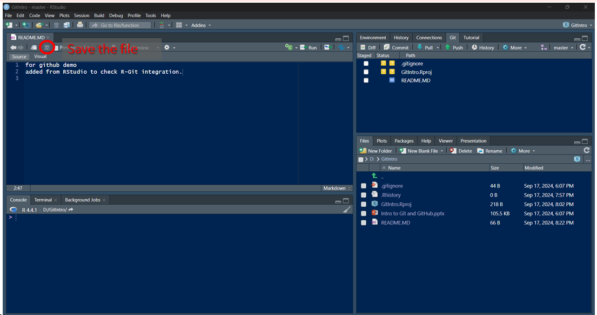

**Once you saved the modified file, it will appear on Git window**.

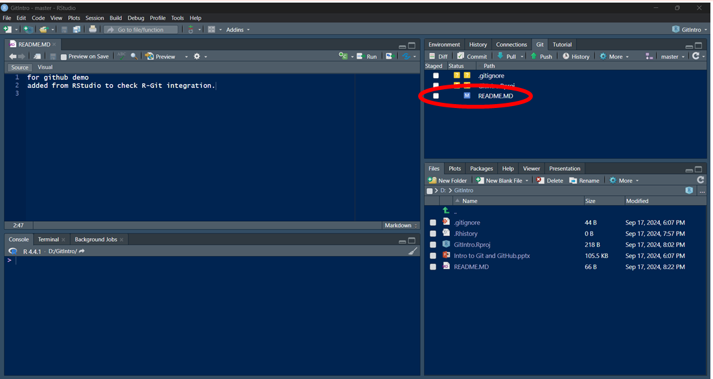

**Click the checkbox  to stage files (=`git add`)**

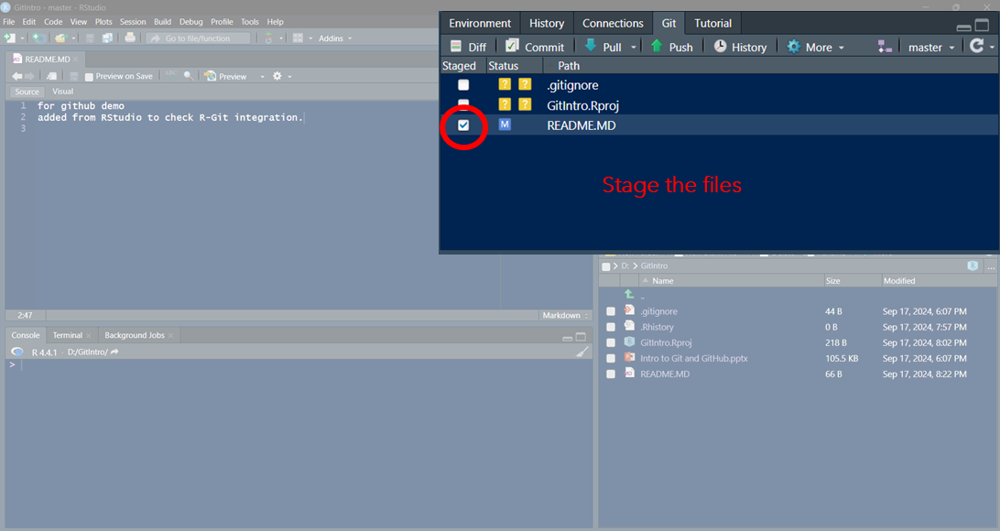

**Then click commit (= `git commit`)**

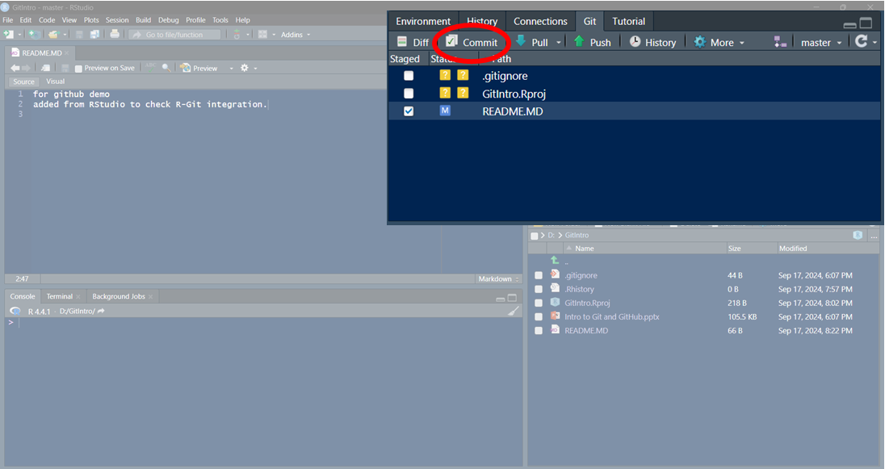

**Add the commit message on the pop up window.**

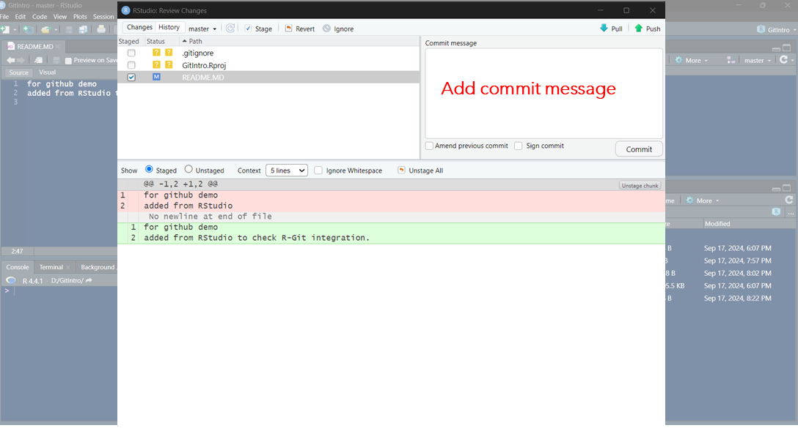

**Click push to send changes to GitHub**

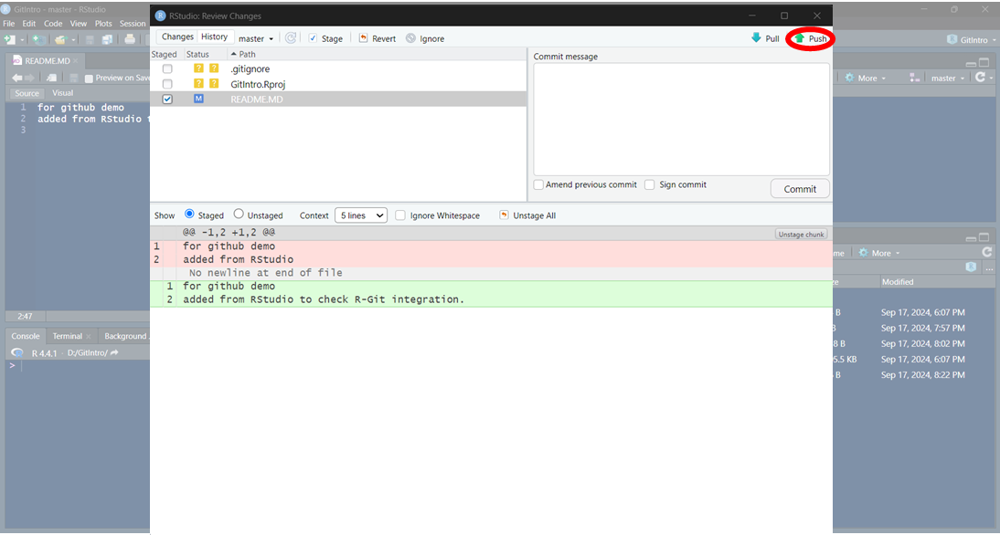


# Cheat sheet

```markdown
# Git Cheat Sheet: Essential Commands

## Setup & Configuration
```sh
git config --global user.name "Your Name"          # Set username
git config --global user.email "your@email.com"    # Set email
git config --list                                 # View settings
```

## Repository Basics
```sh
git init                          # Initialize new repo
git clone <repo-url>              # Clone existing repo
git status                        # Show working directory status
```

## Staging & Committing
```sh
git add <file>                    # Stage specific file
git add .                         # Stage all changes
git commit -m "Commit message"    # Commit staged changes
git commit --amend                # Edit last commit
```

## Branching
```sh
git branch                        # List branches
git branch <name>                 # Create new branch
git checkout <branch>             # Switch branches
git switch                        # modern version of checkout
git checkout -b <new-branch>      # Create & switch to branch
git merge <branch>                # Merge branch into current
```

## Remote Repositories
```sh
git remote add origin <url>       # Add remote repository
git push -u origin <branch>       # Push branch to remote
git pull origin <branch>          # Pull remote changes
git fetch                         # Download objects without merging
```

## Undoing Changes
```sh
git restore <file>                # Discard unstaged changes
git reset <file>                  # Unstage file
git reset --hard HEAD             # Discard all local changes
git revert <commit-hash>          # Create undo commit
```

## Stashing
```sh
git stash                         # Stash current changes
git stash list                    # List stashes
git stash pop                     # Apply most recent stash
git stash apply stash@{n}         # Apply specific stash
```

## Log & History
```sh
git log                           # Show commit history
git log --oneline                 # Compact history
git log --graph                   # Visual branch history
git diff                          # Show unstaged changes
```

## Collaboration
```sh
git fork                          # Fork a repo (GitHub web UI)
git pull-request                  # Create PR (GitHub CLI)
git cherry-pick <commit>          # Apply specific commit
```

## .gitignore

Create `.gitignore` file to exclude:
- Local config files
- Dependencies (node_modules/)
- Sensitive data (.env)
- System files (.DS_Store)


**Pro Tip:** Use `git <command> --help` for detailed documentation on any command.


